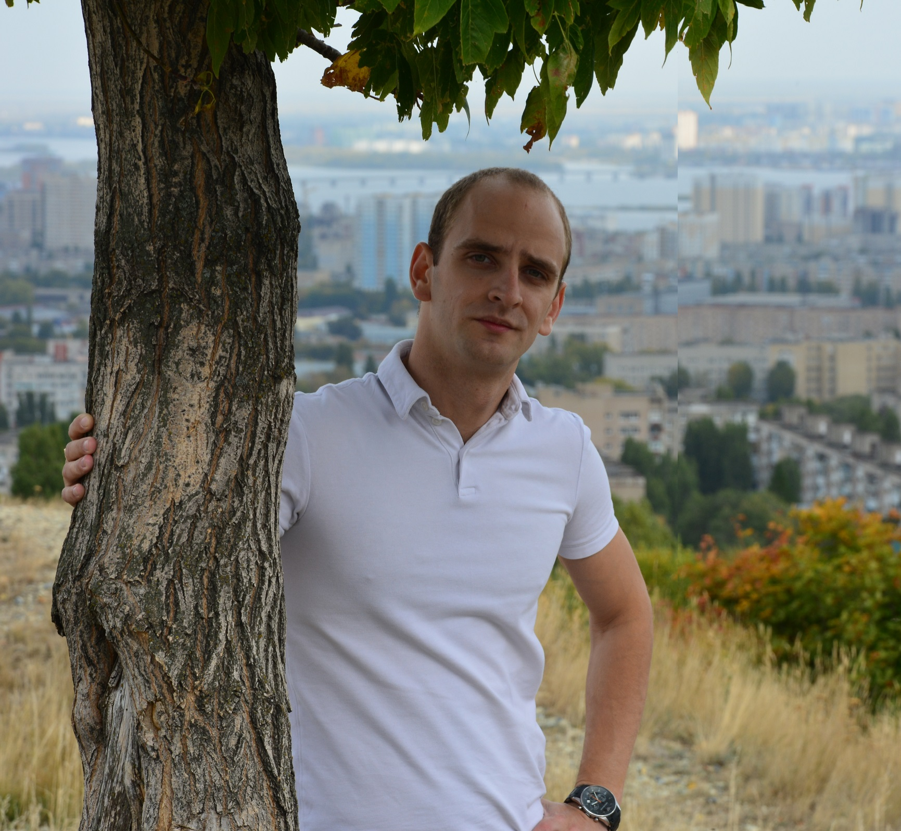

# Artem Myzrov


## Сontact details:

- **Address:** Russia,Saratov
- **Phone:** +7-996-203-98-06
- **E-mail:** a.myzrov@yandex.ru
- **GitHub:** [ArtemMyzrov](https://github.com/ArtemMyzrov)
- **Discord:** ArtemMyzrov
- **Telegram:** @Artem_Myzrov

## About me:

*At this stage of my life, I plan to get additional education, change my field of activity and become a real web developer. To do this, I am currently learning the basics and taking courses. In the future, I plan not to stop developing and gaining practical experience.*

***********************
## Skills:

-HTML


-CSS


-JavaSkript


-Git/GitHub


-Figma

***********************
## Code Examples:

```
function multiply(a, b){
 return a * b
}

```


***********************
## Experience:

I worked as a DJ for 7 years,
then for about 5 years in sales,
now I have only a little experience in website development.

***********************


## Examples of works:

This is my first project
[rsschool-cv](https://github.com/ArtemMyzrov/rsschool-cv)


***********************
## Education:

secondary education

***********************


## English:
 - A1

 I use the Duolingo app to study and often use Google translate to 
    solve problems.